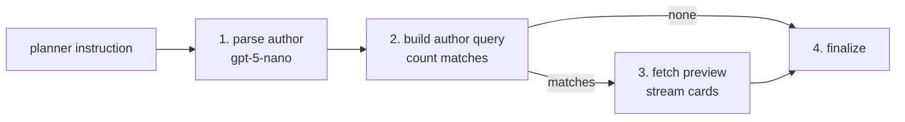

# Retrieve_by_Author

`Retrieve_by_Author` is the BookShelf node that finds one author's books — "books by Ursula K. Le Guin", "what else has Brandon Sanderson written". It counts the matches and hands the search on as a query, so a later step can narrow the bibliography (by page count, say) or check it against a title.

It has the same shape as [find_by_title/](../find_by_title/): one LLM call, one query, no upstream inputs.

## Flow

1. **Parse** — the planner's instruction goes to the LLM, which fills in `FindByAuthorArgs` (the author).
2. **Count** — builds the author query and runs only a `COUNT`; no rows are fetched.
3. **Preview** — when something matched, fetches a few rows and streams them as book cards.
4. **Finalize** — marks the node done.

An author matches when the name appears anywhere in the book's author credit (case-insensitive) or is a close fuzzy match to part of it (Postgres `word_similarity`). A co-written book ("Brian Herbert;Kevin J. Anderson") shows up on either author's search.

## Tools

- **`FindByAuthorArgs`** — the node's own parse schema, never seen by the planner: one field, `author`. One author per node; several authors' separate bibliographies become several nodes.

## Contract

| | Shape | Notes |
|---|---|---|
| Request | `FindByAuthorRetrieval` | No fields — its docstring is what the planner reads to choose this node |
| Input | `FindByAuthorInput` | The planner's instruction only; takes no upstream output |
| Output | `FindByAuthorOutput` (a `BookCandidateOutput`) | `args`, `num_books`, `query`, `preview` |

The output is a **candidate** set, not an anchor: a bibliography can be twelve books or eight hundred, so it can't be folded into "books like this author's". `Analyze_Similar_Books` can't depend on it.

Fields and docstrings: [external.py](external.py).

## Errors

- **No match is not a failure.** `num_books == 0` means the catalog has nothing by that author, and the node still finishes ok.
- **The node fails** when the parse returns no author or the query can't be built. The reply then says that step couldn't run.

## Combining with other nodes

For "Dune by Frank Herbert" or "did Frank Herbert write Dune", the planner pairs this node with `Retrieve_by_Title` and joins the two with `Combine_Intersect`. An empty intersection is the answer to "did X write Y?". Bounds on a bibliography ("King books over 500 pages") are `Retrieve_by_Numeric_Traits` plus the same intersect.
