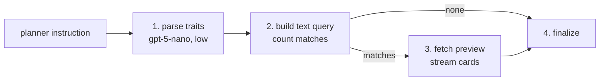

# Retrieve_by_Lexical_Traits

`Retrieve_by_Lexical_Traits` is the BookShelf node that finds books by the words in their text and the shelf they sit on — "books about ninjas", "non-fiction about history", "children's books". It is the node for any ask that is neither a number nor a named book or author. It counts the matches and hands the search on as a query.

It is **lexical**, not semantic: it finds books whose title, shelf label or description literally contains the words. A mood or feel ("cozy", "hopeful") isn't in the text, so the planner drops it — "cozy mysteries" searches for `mystery`.

## Flow

1. **Parse** — the LLM fills in `FindByLexicalTraitsArgs` from the planner's instruction, using this node's own prompt ([prompts/](prompts/)), which allows narrow inferences like "children's books" → `audience: children`.
2. **Count** — builds the query and runs only a `COUNT`.
3. **Preview** — when something matched, fetches a few rows and streams them as book cards.
4. **Finalize** — marks the node done.

The three traits are ANDed:

- **Keywords** — full-text search (Postgres `tsvector`) over title, shelf label and description together. Every keyword must appear, and matching is by word stem, so plurals are handled. Results are ranked by text match.
- **Genre** — fiction or non-fiction only. Finer shelf words ("mystery", "biography") are keywords.
- **Audience** — children or adult.

With no keywords there's nothing to rank by text, so the preview is ordered by rating.

## Tools

- **`FindByLexicalTraitsArgs`** — the node's own parse schema, never seen by the planner: `keywords` (up to 4), `genre`, `audience`. Its field descriptions tell the model how to fill each one.

## Contract

| | Shape | Notes |
|---|---|---|
| Request | `FindByLexicalTraitsRetrieval` | No fields — its docstring is what the planner reads to choose this node |
| Input | `FindByLexicalTraitsInput` | The planner's instruction only; takes no upstream output |
| Output | `FindByLexicalTraitsOutput` (a `BookCandidateOutput`) | `args`, `num_books`, `query`, `preview` |

The output is a **candidate** set: "mystery" matches hundreds of books, which can't be folded into one description, so `Analyze_Similar_Books` can't depend on it.

Fields and docstrings: [external.py](external.py), [tools.py](tools.py).

## Errors

- **No match is not a failure.** `num_books == 0` is a real answer, and the moment to try a broader word.
- **The node fails** when the parse finds no keyword, genre or audience — the goal was sent to the wrong node. An empty search would match the whole catalog, so it's refused.

## Combining with other nodes

One node covers one subject; "mysteries and cookbooks" is two nodes. A bound riding along ("fantasy over 400 pages") is `Retrieve_by_Numeric_Traits` plus `Combine_Intersect`, not a trait here.
