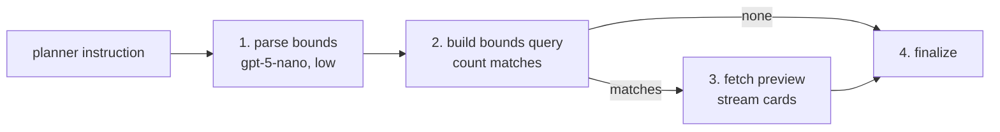

# Retrieve_by_Numeric_Traits

`Retrieve_by_Numeric_Traits` is the BookShelf node that finds books by measurable bounds — page count, publication year, average rating, number of ratings. It takes figures ("under 200 pages") and words ("well rated", "really long", "obscure") and turns both into bounds. It counts the matches and hands the search on as a query.

## Flow

1. **Parse** — the LLM fills in `FindByNumericTraitsArgs` from the planner's instruction, using this node's own prompt ([prompts/](prompts/)), which tells it to map words onto numbers ("well rated" → rating 4.0 or higher).
2. **Count** — builds the query and runs only a `COUNT`.
3. **Preview** — when something matched, fetches a few rows and streams them as book cards.
4. **Finalize** — marks the node done.

Bounds are inclusive and ANDed. A superlative becomes a tighter bound ("highest rated" → 4.3 or higher), not an ordering. There's no match score, so the preview is ordered by rating.

## Tools

- **`FindByNumericTraitsArgs`** — the node's own parse schema, never seen by the planner: one field, `traits`, a `BookMetadataFilter` (min/max pages, year, rating, rating count). What each bound means is on the filter's field descriptions; the docstring examples show combinations.

## Contract

| | Shape | Notes |
|---|---|---|
| Request | `FindByNumericTraitsRetrieval` | No fields — its docstring is what the planner reads to choose this node |
| Input | `FindByNumericTraitsInput` | The planner's instruction only; takes no upstream output |
| Output | `FindByNumericTraitsOutput` (a `BookCandidateOutput`) | `args`, `num_books`, `query`, `preview` |

The output is a **candidate** set: bounds describe a shelf, never a book.

Fields and docstrings: [external.py](external.py), [tools.py](tools.py).

## Errors

- **No match is not a failure.** Bounds read from words can be tighter than the user pictured; a count of 0 is how they find out.
- **The node fails** when the parse finds nothing measurable (the goal was sent to the wrong node) or the bounds are inverted ("over 400 pages, under 200").

## Combining with other nodes

This node only ever contributes the numbers. A bound on another subject ("Stephen King books over 400 pages") is this node, the subject's retrieval, and one `Combine_Intersect` over both. Without the intersect the two results are pooled, which answers with more books instead of fewer.
