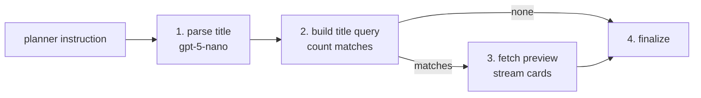

# Retrieve_by_Title

`Retrieve_by_Title` is the BookShelf node that finds a book the user names by its title — "find Dune", "do you have The Great Gatsby". It counts the matches and hands the search on as a query, so a later step can narrow it further (by author, say) or use the book as an anchor for "books like this".

It is also the worked example of a **single-call node**: one LLM call, one query, no upstream inputs. Copy this folder when adding a node of that shape.

## Flow

1. **Parse** — the planner's instruction goes to the LLM, which fills in `FindByTitleArgs` (the title).
2. **Count** — builds the title query and runs only a `COUNT`; no rows are fetched.
3. **Preview** — when something matched, fetches a few rows and streams them as book cards.
4. **Finalize** — marks the node done.

A title matches when it equals the search (case-insensitive) or is a close fuzzy match (Postgres trigram similarity), so small misspellings still find the book.

## Tools

- **`FindByTitleArgs`** — the node's own parse schema, never seen by the planner: one field, `title`. One title per node; several named titles become several nodes.

## Contract

| | Shape | Notes |
|---|---|---|
| Request | `FindByTitleRetrieval` | No fields — its docstring is what the planner reads to choose this node |
| Input | `FindByTitleInput` | The planner's instruction only; takes no upstream output |
| Output | `FindByTitleOutput` (a `BookAnchorOutput`) | `args`, `num_books`, `query`, `preview` |

The output is an **anchor**: the user named this book, so `Analyze_Similar_Books` can search for others like it. What downstream nodes use is `query`, which reaches every match; `preview` is only the few cards shown in the chat.

Fields and docstrings: [external.py](external.py).

## Errors

- **No match is not a failure.** `num_books == 0` is a real answer ("we don't have that title"), and the node still finishes ok.
- **The node fails** when the parse returns no title or the query can't be built. The reply then says that step couldn't run.

## Combining with other nodes

The node searches by title alone and takes no author. For "Dune by Frank Herbert" or "did Frank Herbert write Dune", the planner pairs it with `Retrieve_by_Author` and joins the two with `Combine_Intersect`, so the pairing is checked against the catalog. An empty intersection is the answer to "did X write Y?".
