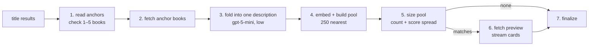

# Analyze_Similar_Books

`Analyze_Similar_Books` is the BookShelf node that finds books close in meaning to books the user named — "books like Dune", "something between Dune and Neuromancer". It reads the named books, writes one description of what they have in common, embeds it, and hands on a query for the nearest books in the catalog.

It is also the worked example of a **multi-step node**: several steps, one LLM call in its own module, and upstream inputs to interpret. Copy this folder when adding a node of that shape.

## Flow

1. **Read anchors** — sorts the upstream results ([dependents.py](dependents.py)) and checks the total before any round trip: at least 1 book, at most 5.
2. **Fetch** — fetches the anchor books' rows.
3. **Fold** — one LLM call reads their descriptions and writes a single "ideal book" description ([analyze_references.py](analyze_references.py)).
4. **Embed and build** — embeds the description and builds the vector search: the 250 nearest books above a minimum similarity, excluding the named books themselves.
5. **Size** — one query returns the pool's count and its similarity spread (min / max).
6. **Preview** — when the pool isn't empty, fetches a few rows, nearest first, and streams them as book cards.
7. **Finalize** — marks the node done.

### Layout

- **[executor.py](executor.py)** is the flow: `run` plus every awaited step as a method, in the order `run` calls them.
- **[analyze_references.py](analyze_references.py)** is the one LLM call's pure half — rendering the books, the `IdealBookDescription` tool and the request builder. Nothing in it runs.
- **[dependents.py](dependents.py)** interprets the upstream results (`ParsedDependents`).

## Tools

- **`IdealBookDescription`** — the fold call's schema, never seen by the planner: one field, `semantic_input`, the description that gets embedded.

## Contract

| | Shape | Notes |
|---|---|---|
| Request | `SimilarBooksSearch` | No fields — its docstring is what the planner reads to choose this node |
| Input | `SimilarBooksInput` | `anchors`: 1+ `BookAnchorOutput`s (title results) |
| Output | `SimilarBooksOutput` (a `BookCandidateOutput`) | `num_books`, `query`, `preview`, plus `references`, `args.search_text`, `score` |

Only anchors are accepted: a subject search or a bibliography can't be folded into one description, so a plan that tries is skipped before the node runs. The output is a **candidate** set, so one similarity search can never seed the next.

Several named books in **one** goal are blended into one pool ("between Dune and Neuromancer"). Separate pools ("like Dune or like Neuromancer") are one goal per book.

`num_books` mostly reports the pool size (up to 250); `score` says how close the pool sits. Intersecting the pool is safe and keeps its order. Pooling it with another result (OR) is not — see `DeferredBookQuery` in [db/stores/](../../../../db/stores/).

Fields and docstrings: [external.py](external.py).

## Errors

- **An empty pool is not a failure.** Nothing in the catalog sits near the named books, and the node still finishes ok.
- **The goal is skipped** when it depends on no title result.
- **The node fails** when the anchors hold no books, more than 5 books, or books with no descriptions to fold.
