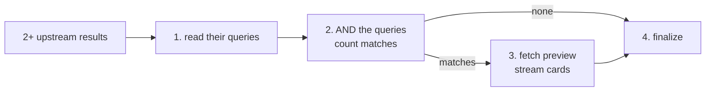

# Combine_Intersect

`Combine_Intersect` is the BookShelf node that keeps only the books every one of several earlier searches found — "fantasy books over 400 pages", "did Jane Austen write thrillers?". It searches for nothing itself: it ANDs the upstream queries together in SQL, counts the result and hands it on.

It is the one node with no LLM call. What it does is decided entirely by which goals it depends on.

## Flow

1. **Read** — takes the `query` off each upstream output and shows the upstream counts in the details (`12 ∩ 340`).
2. **Count** — composes the queries with AND into one and runs only a `COUNT`.
3. **Preview** — when something survived, fetches a few rows and streams them as book cards.
4. **Finalize** — marks the node done.

Intersecting queries rather than previews means the count is over every upstream match, not over the four cards each one showed. When one input is a similarity pool, its ranking survives: the preview is still ordered nearest first.

## Contract

| | Shape | Notes |
|---|---|---|
| Request | `CombineIntersect` | No fields — its docstring is what the planner reads to choose this node |
| Input | `CombineIntersectInput` | `anchors`: 2+ book outputs of any kind |
| Output | `CombineIntersectOutput` (a `BookRetrievalOutput`) | `num_books`, `query`, `preview` |

How each set was found doesn't matter — a title, a bibliography, a subject search, a bound and a similarity pool are all just sets of books here. The output is the base shape, neither anchor nor candidate, so `Analyze_Similar_Books` can't depend on it.

Fields and docstrings: [external.py](external.py).

## Errors

- **No match is not a failure.** An empty intersection is a real answer — no book satisfied every condition — and the moment to drop one.
- **The goal is skipped** when it depends on fewer than two results.
- **The node fails** when fewer than two of its inputs carry a query. Every registered node hands one on, so this means a malformed upstream output.

## Combining with other nodes

When conditions must hold on the same book, the planner gives each condition its own retrieval and one intersect over all of them ("horror by Stephen King over 500 pages" is three retrievals and one intersect). Leaving the intersect out pools the results, which answers with more books instead of fewer.
